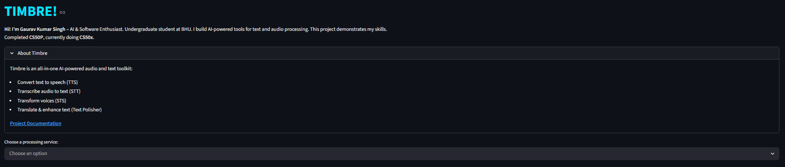
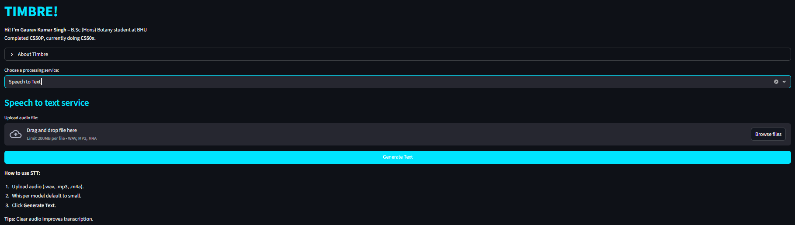
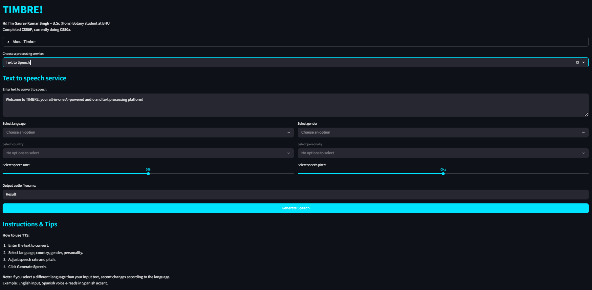
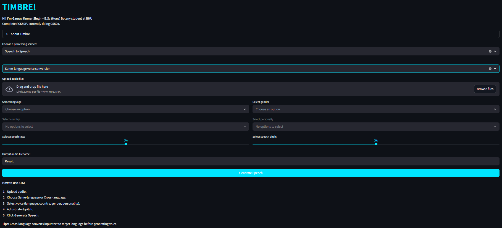
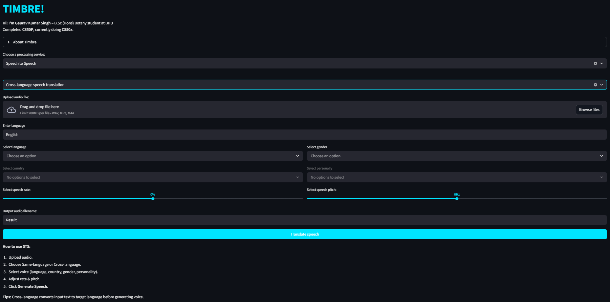
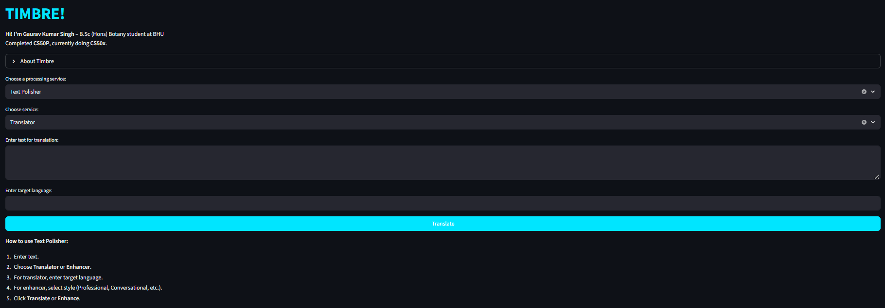
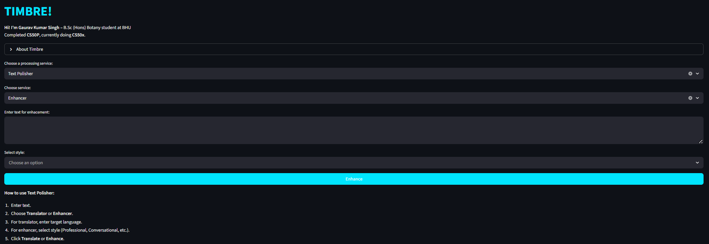

# TIMBRE! — Advanced AI Audio & Text Toolkit 🚀

**TIMBRE!** is a high-performance, modular AI application designed to bridge the gap between speech and text. Built with a "Privacy-First" and "Efficiency-First" mindset, Timbre leverages state-of-the-art (SOTA) models like Google Gemini 2.5 Flash and OpenAI Whisper to provide a seamless multilingual experience.

### Video Demo: cooming soon

- landing page
  

## 🌟 Key Features
Timbre is organized into four core processing services, accessible via an intuitive "Electric Cyan" themed dashboard:
- **Speech to Text (STT):**
  High-accuracy transcription using the **OpenAI Whisper (Small)** model. Optimized for low-latency performance on cloud environments.
  - Audio → Text → Grammar enhancement
  - screenshot
    
- **Text to Speech (TTS):**
  Generate natural-sounding neural voices in 100+ languages and accents. Features real-time streaming and adjustable speech rate/pitch and vocie selection.
  -  Audio → Text
  - screenshot
    
- **🔄 Speech to Speech (STS):**
  - **Same-language conversion:** Transform your voice into different neural personalities.
     - Audio → Text → Grammar enhancement → Audio.
     - screenshot
       
  - **Cross-language translation:** Speak in one language and hear the output in another, preserving clarity and context.
     - Audio → Text → Translation → Grammar enhancement → Audio.
     - screenshot
       
- **Text Polisher:**
   - **Translator:** Professional-grade translation that preserves formatting.
      - Text → Translation
      - screenshot
        
   - **Enhancer:** Refine grammar and syntax or completely transform the tone (Professional, Creative, Technical, etc.) using Gemini 2.5 Flash.
      - Text → Grammar or Style enhancement 
      - screenshot
        
## 🛠️ The Tech Stack
| Component | Technology |
|----------|------------|
| **Frontend** | [Streamlit](https://streamlit.io/) - (Custom UX/UI with Dark Mode & High Contrast) |
| **Intelligence** | [Google Gemini 2.5 Flash](https://ai.google.dev/) - (Advanced reasoning, translation & text enhancement) |
| **Transcription** | [OpenAI Whisper](https://github.com/openai/whisper) – (Small model optimized for low-RAM cloud environments) |
| **Neural Voices** | [Edge-TTS](https://github.com/rany2/edge-tts) – (Microsoft Azure Neural Voices) |
| **Backend Logic** | [Asynchronous Python](https://docs.python.org/3/library/asyncio.html) - (Asyncio), [Object-Oriented Programming](https://docs.python.org/3/tutorial/classes.html) - (OOP) |
| **Infrastructure** | [FFmpeg](https://ffmpeg.org/) - (Audio processing engine), [Streamlit Community Cloud](https://streamlit.io/cloud) |

## 🏗️ Modular Architecture
```
timbre-web/
├── .streamlit/
│   └──config.toml             # Custom Theme
├── data/
│   └── voices.json            # 100+ Neural voice metadata
├── timbre_module/             # Core Logic Package
│   ├── __init__.py            # Package initialization
│   ├── polisher.py            # Gemini 2.5 Flash Integration
│   ├── stt.py                 # Whisper STT Logic
│   └── tts.py                 # Edge-TTS Async Logic
├── scripts/                   # Automation
│   └── voice_extractor.py     # Automated data pipeline for voices
├── app.py                     # Streamlit Main Interface
├── requirements.txt           # Python Dependencies
├── packages.txt               # OS-level dependencies (ffmpeg)
└── LICENSE.txt                 
```
---

## ⚙️ Local Installation

### 1️⃣ Clone the repository
```bash
git clone https://github.com/thegksingh/Timbre-web.git
cd Timbre
```

### 2️⃣ Create a virtual environment
```bash
python -m venv venv
```

### 3️⃣ Activate the virtual environment
#### On macOS/Linux:
```bash
source venv/bin/activate
```
#### On Windows:
```bash
.\venv\Scripts\activate
```

### 4️⃣ Install dependencies
```bash
pip install -r requirements.txt
```

### 5️⃣ Set up your API Key
```bash
echo "GOOGLE_API_KEY=your_actual_key_goes_here" > .env
```

## 6️⃣ Run the app:
```bash
streamlit run app.py
```
## 👤 About the Author
**Gaurav Kumar Singh** B.Sc (Hons.) Botany Student at Banaras Hindu University (BHU) I am a self-taught developer passionate about building cross-functional AI tools. My journey started with CS50P (Intro to Programming with Python) and continues through CS50x. Timbre represents my ability to apply complex computer science concepts—like asynchronous programming, data parsing, and LLM integration—to real-world problems.

## 📜 License
Distributed under the MIT License. See LICENSE for more information.
